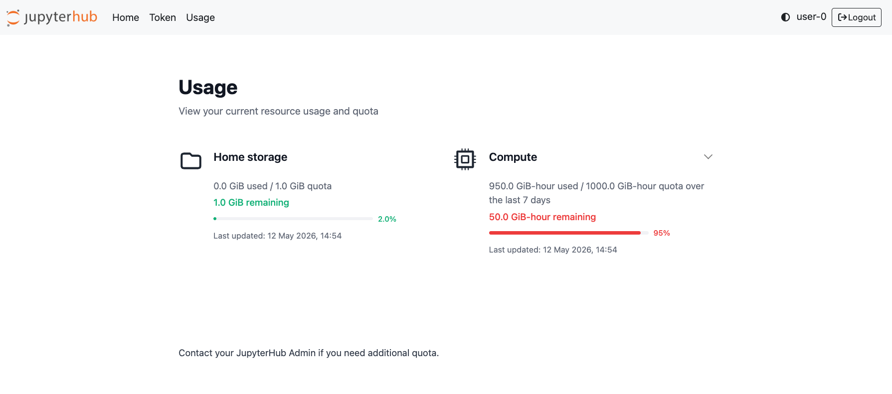

# JupyterHub Usage Quotas


This library implements compute usage quotas for Jupyter servers at server startup-time to manage resource consumption across shared infrastructure managed by [Zero to JupyterHub with Kubernetes](https://z2jh.jupyter.org/en/stable/) deployments.

## Features

- Metric based accounting for compute usage with Prometheus
- Flexible and declarative usage policies, such as quota sizes and quota time windows
- Quota enforcement at server startup-time
- User-facing usage and quota dashboard (optional)



## Installation

The [PyPI package](https://pypi.org/project/jupyterhub-usage-quotas/) can be installed with

```bash
pip install jupyterhub-usage-quotas
```

To also install the user-facing storage usage dashboard service:

```bash
pip install "jupyterhub-usage-quotas[service]"
```

For local development, see the [development guide](./DEVELOPMENT.md)

## Documentation

Documentation can be found at [https://jupyterhub-usage-quotas.readthedocs.io/en/latest/](https://jupyterhub-usage-quotas.readthedocs.io/en/latest/)

## Contributing

See the guidance in [CONTRIBUTING](CONTRIBUTING.md)

## License

This project is licensed under the [BSD 3-Clause License](LICENSE.md).
