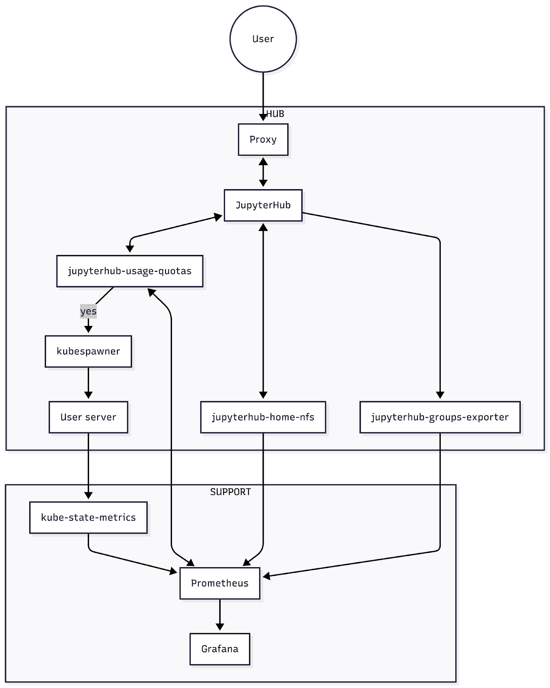

# Overview

The `jupyterhub-usage-quotas` system is designed to operate within a [Zero to JupyterHub](https://z2jh.jupyter.org/) Kubernetes deployment. In the description below we generally make a distinction between two namespaces, **Hub** and **Support**, though your particular deployments may differ.

## Hub

Each cluster may contain multiple hub namespaces, e.g. production, workshop, staging hubs, each running a single hub. The hub namespace contains the user entrypoint to JupyterHub, connected via a proxy. JupyterHub handles user authentication and passes resource requests (i.e. RAM and CPU requests) to the [kubespawner](https://github.com/jupyterhub/kubespawner) to spin up pods to launch single user servers. Critically, the `jupyterhub-usage-quotas` system hooks into the pre-spawn stage to make yes/no decisions about whether a user can launch a server if they are under/above their usage quota. Usage is calculated by aggregating Prometheus metrics. Other optional components in the hub namespace that can export metrics include:

1. [jupyterhub-home-nfs](https://github.com/2i2c-org/jupyterhub-home-nfs), an NFS server for home directories with its own quota enforcement, which exports storage usage and quota Prometheus metrics
1. [jupyterhub-groups-exporter](https://github.com/2i2c-org/jupyterhub-groups-exporter), which exports JupyterHub user group memberships Prometheus metrics

## Support

Each cluster can run support components, which we group into a support namespace. One more exporter of interest here is:

3. [kube-state-metrics](https://github.com/kubernetes/kube-state-metrics), which monitors Kubernetes objects, including container memory and cpu requests, and exports them as Prometheus metrics.

Prometheus continually scrapes data from all of these exporters and stores them in a time series database. Other services, including `jupyterhub-usage-quotas`, can consume the data through its API using PromQL, a querying language to select and aggregate data in near real time. Grafana, or AWS CloudWatch Dashboards, are examples of other services that consume Prometheus datasources for visualisation and dashboards.
